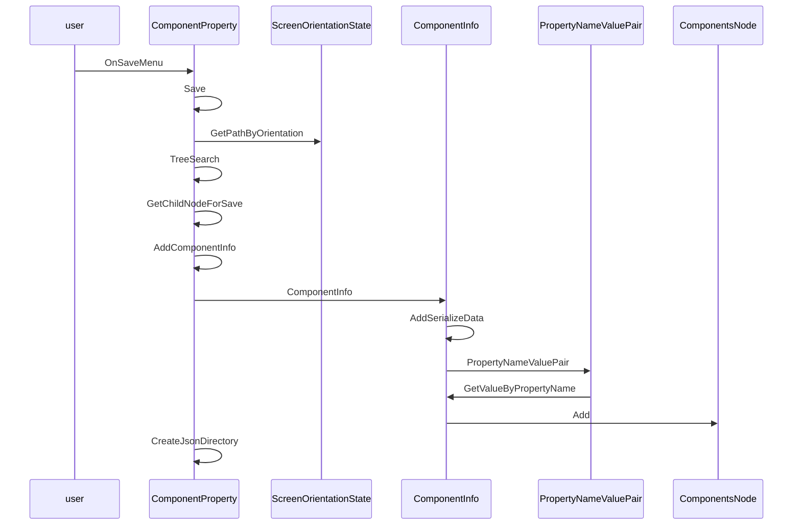
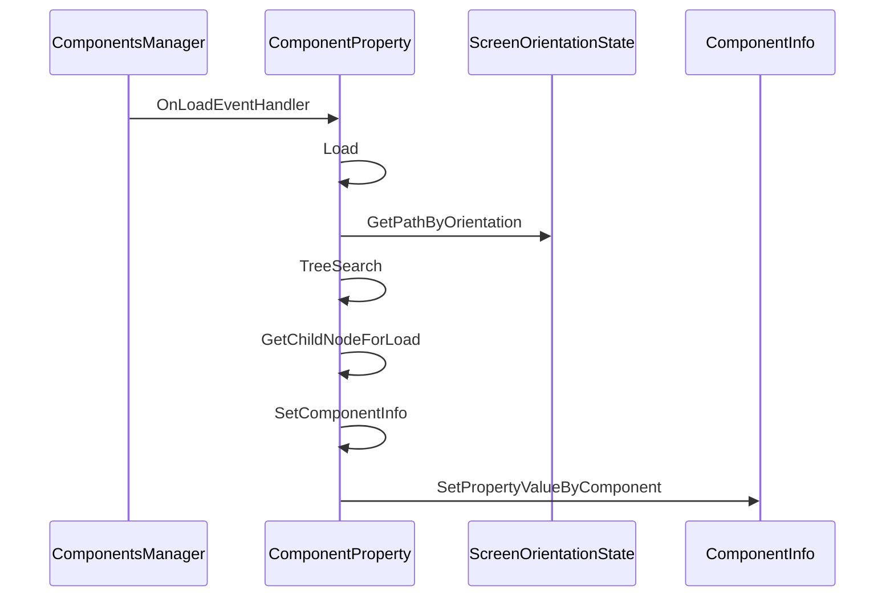

# UI Rotaion Behavior 설계

## 저장 로직

```mermaid
sequenceDiagram
    participant user as user
    participant Property as ComponentProperty
    participant State as ScreenOrientationState
    participant Info as ComponentInfo
    participant Pair as PropertyNameValuePair
    participant Node as ComponentsNode

    user->>Property: OnSaveMenu
    Property->>Property: Save
    Property->>State: GetPathByOrientation
    Property->>Property: TreeSearch
    Property->>Property: GetChildNodeForSave
    Property->>Property: AddComponentInfo
    Property->>Info: ComponentInfo
    Info->>Info: AddSerializeData
    Info->>Pair: PropertyNameValuePair
    Pair->>Info: GetValueByPropertyName
    Info->>Node: Add
    Property->>Property: CreateJsonDirectory
```

## 불러오기 로직

```mermaid
sequenceDiagram
    participant Manager as ComponentsManager
    participant Property as ComponentProperty
    participant State as ScreenOrientationState
    participant Info as ComponentInfo

    Manager->>Property: OnLoadEventHandler
    Property->>Property: Load
    Property->>State: GetPathByOrientation
    Property->>Property: TreeSearch
    Property->>Property: GetChildNodeForLoad
    Property->>Property: SetComponentInfo
    Property->>Info: SetPropertyValueByComponent
```